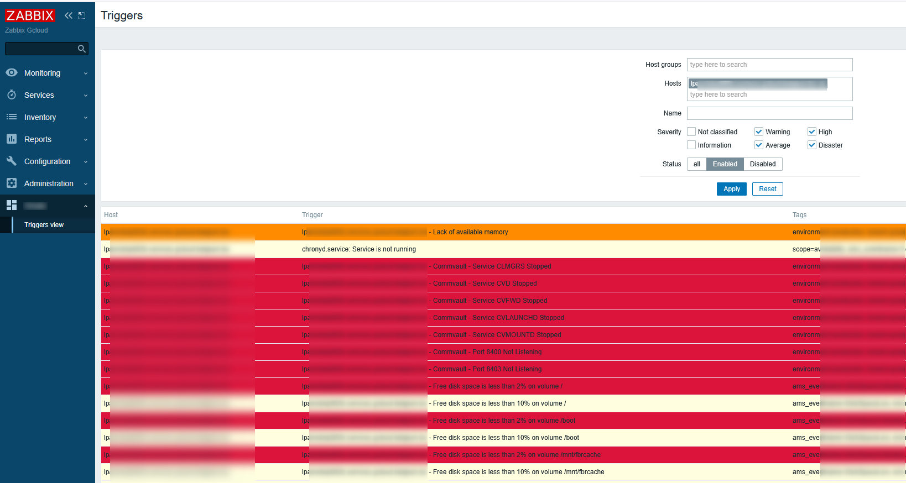

# ZabbixAdminRoModule

An important Zabbix limitation is the fact that users without administrative rights cannot *view* the configuration of hosts they have read-only access: They can view collected data, graphs, and problems for example but they can't view the *exact* list of items monitored, nor can they view the list of triggers configured (See https://support.zabbix.com/browse/ZBXNEXT-1070 for a lengthly discussion on the topic).

This is a major limitation when you think of it, because, while users can view that there's no problem for "their" hosts, they have hard time figuring out if that it is because there are really no problems on them or that it is because there are actually ***no triggers*** assigned to them.

This module is an attempt to address this issue. It works well in our environments (Zabbix 6.0 and Zabbix 7.0), but the code here is only a redacted version of it which I haven't tested.

It's based on information I've found on:

- https://www.zabbix.com/documentation/current/en/devel/modules
- https://blog.zabbix.com/deep-dive-into-zabbix-frontend-modules/24863/
- https://framagit.org/zabbix-modules/get-host-ro

# Features

After installing this module, you will be presented with a new "Custom" menu (redacted in the screenshot here below) containing one "Triggers view" entry. Clicking on this menu entry will present you with a "Triggers" view that you can use to see triggers assigned to hosts you have at least read-access to. This view offers you most of the usual filters you are accustomed to in a pristine Zabbix installation:

# Installing the module

Installation instructions can be found in Zabbix's official documentation: https://www.zabbix.com/documentation/current/en/manual/extensions/frontendmodules.

Pay attention that you need to install the module on all instances when you are using multiple (eg. load balanced) Zabbix frontends.